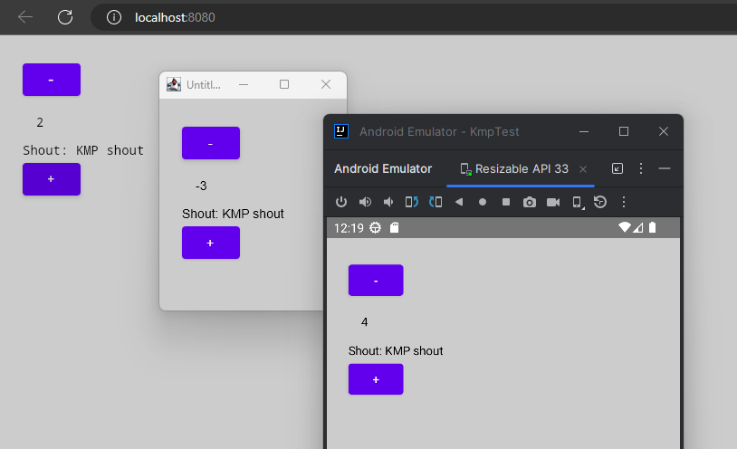
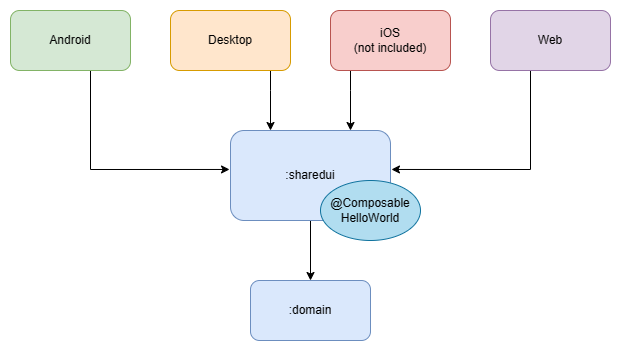

# Hello World @ Android/Desktop/Web KMP with Compose

Demonstrates how to share one Composable between Android, Desktop and Web app.
iOS is omitted because I don't own Apple hardware to test it on, but it should be
straightforward to add.



### Dependencies

* Jetbrains Compose for UI
* Touchlab Kermit for logging

### Running the app

#### Android
`gradlew android:installDebug`

#### Desktop
`gradlew desktop:run`

#### Web
`gradlew web:jsRun`

## Architecture



## Web Canvas rendering 

The Web app uses experimental Canvas rendering, instead of the longer-existing
approach that renders Composables to DOM elements. Here's a comparison between the two:

Before, using Compose API to manipulate DOM elements:

```kotlin
Div({ style { padding(25.px) } }) {
    Button(attrs = { onClick { something() } }) {
        Text("My Button")
    }
    Span({ style { padding(15.px) }}) {
        Text("Some text")
    }
}
```

Observe how this is essentially a `<div>` and a `<span>`, written declaratively.

After, using the exact same Compose API as Android/iOS/Desktop:

```kotlin
Column(modifier = Modifier.padding(25.dp)) {
    Button(onClick = { something() }) {
        Text("My Button")
    }
    Text(modifier = Modifier.padding(15.dp), text = "Some text")
}
```

Thanks to this, it's now possible to share Composables between all platforms, as this
repository demonstrates with the `[sharedui]` module.